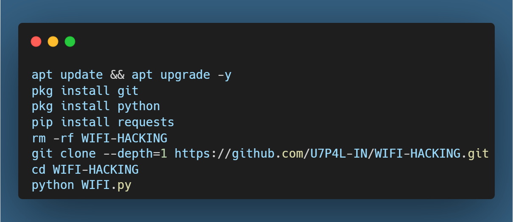
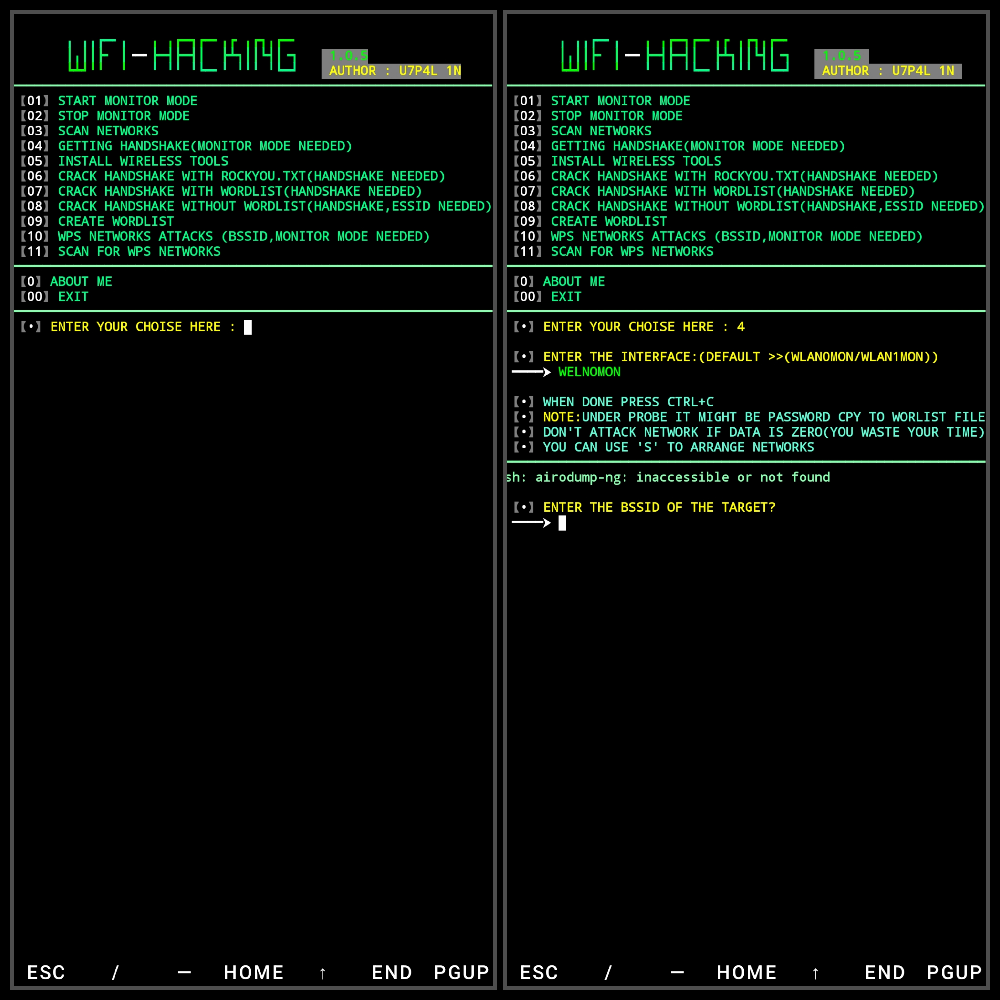
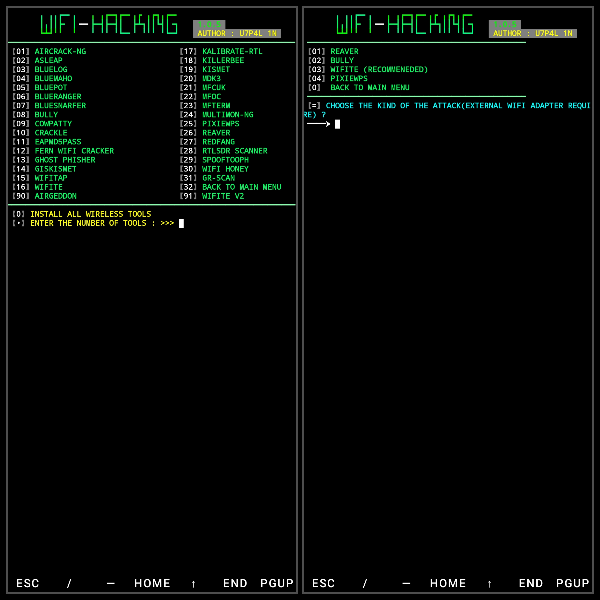
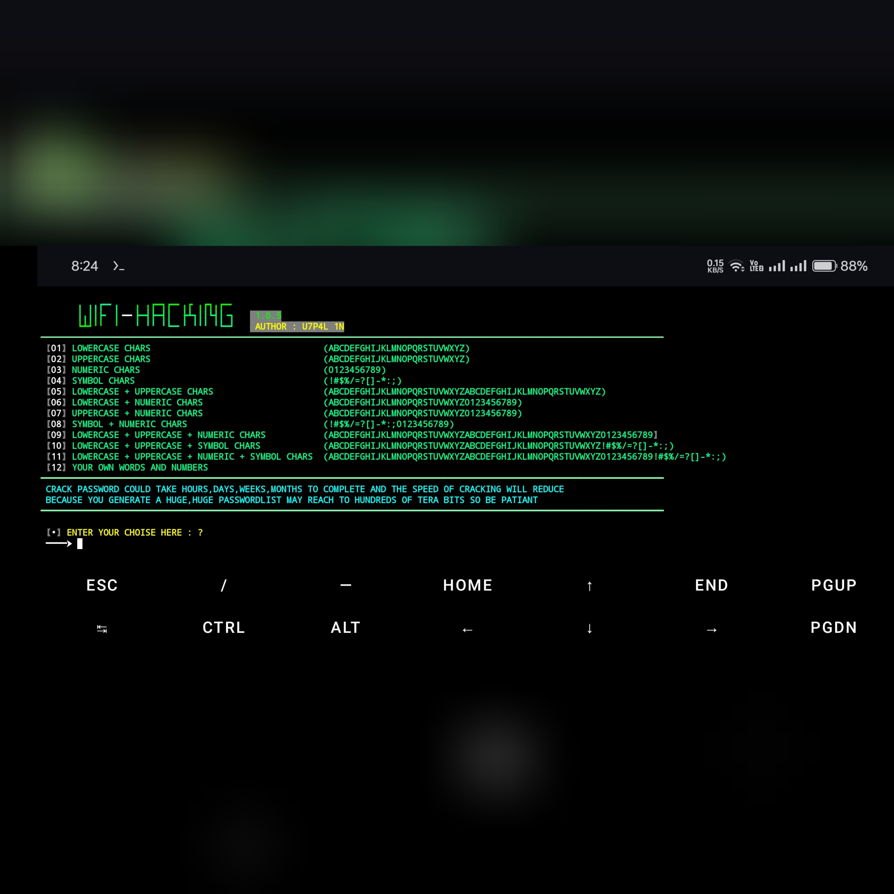

<p>
<p align="center">
  &nbsp;
  &nbsp;
  &nbsp;
 
#### Language > </br>

 <p align="center">

>WiFi hacking tools are software used to exploit vulnerabilities in wireless networks, often for security testing or unauthorized access .

#### Feutures and Containt :
- [1] Start monitor mode
- [2] Stop monitor mode
- [3] Getting Handshake
- [5] Install Wireless tools                  
- [6] WPS Networks attacks 
- [7] Scan for WPS Networks
- [8] Crack Handshake with rockyou.txt
- [9] Crack Handshake with wordlist
- [10] Crack Handshake without wordlist

### Tested On :

* Kali Linux
* BlackArch Linux
* Ubuntu
* Kali Nethunter
* Termux ( Rooted Devices)

<p align="center">

</br><h1 align="center">Installation > </h1>

<h3 align="left">INSTALL TOOL ON ROOTED TERMUX > </h3><br>

```python
apt update && apt upgrade -y
pkg install git
pkg install python
pip install requests
rm -rf WIFI-HACKING
git clone --depth=1 https://github.com/U7P4L-IN/WIFI-HACKING.git
cd WIFI-HACKING
python WIFI.py 
```
<p align="center">
</p>
<p align="center">
</p>
<p align="center">
</p>
<p align="center">
</p>


# Report bugs
If you notice issues while installing this tool or running this tool kindly mail to me at <a href="mailto: liosame0007@gmail.com">Gmail</a> or Open an issue via github.

### Requirements 
```
python-3
pip
Internet Connection
And some other python packages
``` 
[Python 3](https://www.python.org/downloads/)

<hr>

<h3 align="left">Install Requirements (on Linux) > </h3>

```python
>> apt-get install git python3 python3-pip python python-pip
```
<h2 align="left">Kali Linux/Ubuntu/Parrot os > </h2>

```python
sudo apt-get update && apt-get install git
git clone https://github.com/U7P4L-IN/WIFI-HACKING.git
ls
cd WIFI-HACKING
sudo python3 WIFI.py
```
 <p align="center">
</p>
<p align="center">
</p>
<p align="center">
</p>
<p align="center">
</p>

### Languages :

<p align="center">
</p>

For more convoluted language, see the [LICENSE](/LICENSE).
</br>

<p align="center">  <a href="https://t.me/TheU7p4lArmyX"></a></p>

</br>

# Report bugs
If you notice issues while installing this tool or running this tool kindly mail to me at <a href="mailto: lisame0007@gmail.com">Gmail</a> or Open an issue via github.

<h5 align="center"><b>DESCRIPTION</b></h5>

* ©️ Copyright Message
>> Copyright © [2023-27] [U7P4L-IN]
>All rights reserved. This Python project, along with its code, documentation, and any associated files, is the intellectual property of ANONYMOUS CYBER. You may not reproduce, distribute, or modify the contents of this repository without explicit permission from the owner.
# Give A Star ⭐

> You can also give this repository a star to show more people and they can use this repository
